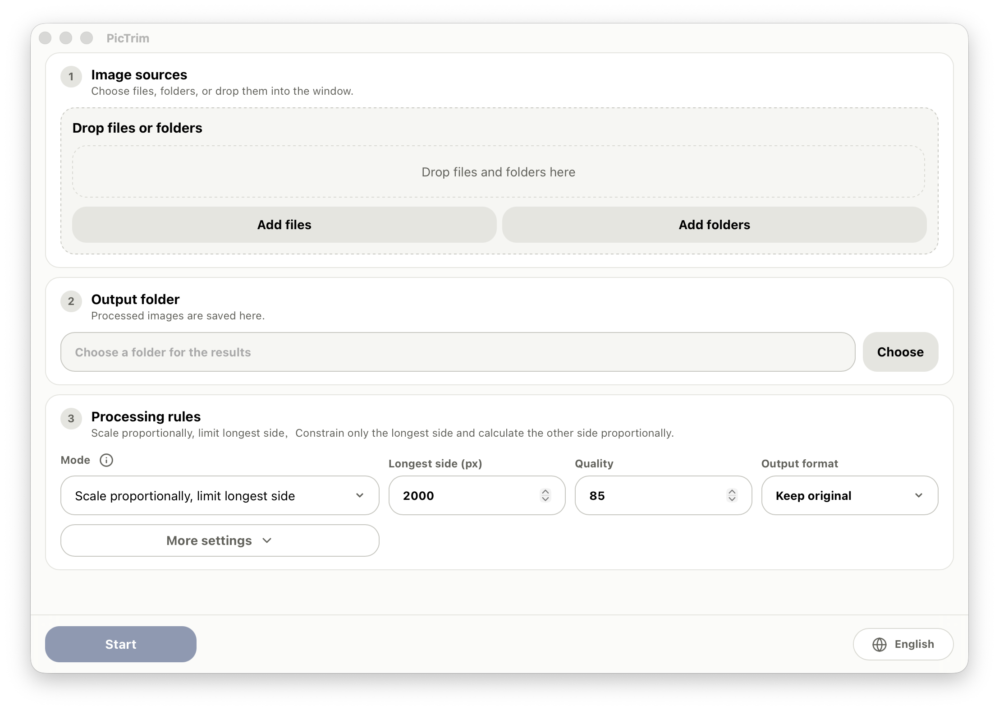

<p>
  
</p>

[English](README.md) | [中文](docs/readme/README.zh-CN.md) | [日本語](docs/readme/README.ja.md) | [한국어](docs/readme/README.ko.md) | [Français](docs/readme/README.fr.md) | [Deutsch](docs/readme/README.de.md)

PicTrim is a high-performance batch image processing tool for resizing, compressing, rotating, and converting images.

## Screenshot



## Features

- Mix image files and folders as input, or drag them directly into the app.
- Batch resize by longest side, bounding box, fixed crop, width, or height.
- Export JPG, PNG, and WebP, or keep the original format.
- Configure quality, rotation, concurrency, upscaling, existing-file handling, and non-image file handling.
- Preserve folder structure while showing live progress, stats, logs, and failures.

## Performance

- PicTrim is built to be an extremely fast batch image processing tool.
- The core uses Rust and libvips for high throughput and low memory usage.
- A streaming task queue plus multithreaded processing makes very large image sets practical.
- Existing output files can be skipped, which is useful for repeated or incremental runs.

## Usage

1. Add image files or folders.
2. Choose an output folder.
3. Set the size, format, quality, and batch options.
4. Click "Start".

## Platform Support

- macOS
- Windows 10 / Windows 11 64-bit

Current release builds target macOS and Windows x64. Linux packages are not provided yet.

## Development

```bash
npm install
npm run dev
```

Check the frontend build:

```bash
npm run build
```

Check the Rust side:

```bash
cd src-tauri
cargo check
```

Building or linking the Rust binary requires libvips to be installed locally.

macOS:

```bash
brew install vips
```

On Windows, use the official prebuilt libvips package and set `VIPS_DIR` to the extracted folder:

```powershell
$env:VIPS_DIR = "C:\path\to\vips-dev-8.x"
$env:Path = "$env:VIPS_DIR\bin;$env:Path"
```

You can also refer to the [official libvips installation guide](https://www.libvips.org/install.html).

## Build

```bash
npm install
npm run tauri:build
```

After the build finishes, `release/PicTrim/` contains the local portable build. GitHub Releases publish only the signed and notarized macOS DMGs for Apple Silicon and Intel, plus the Windows x64 installer.

## Release Notes

macOS release builds are signed with a Developer ID certificate and notarized by Apple. Windows builds are currently unsigned and may show a SmartScreen warning on first launch.

See [docs/release.md](docs/release.md) for the detailed release workflow.

## License

PicTrim is released under the [MIT License](LICENSE).
