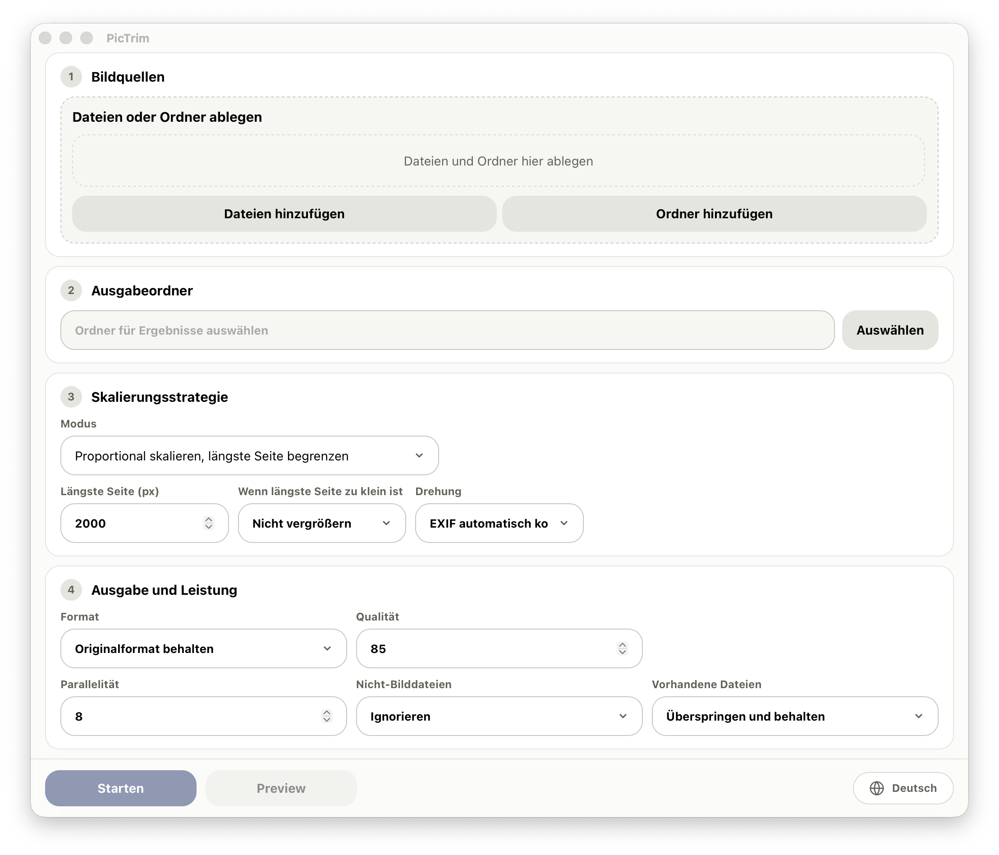

<p>
  
</p>

[English](../../README.md) | [中文](README.zh-CN.md) | [日本語](README.ja.md) | [한국어](README.ko.md) | [Français](README.fr.md) | [Deutsch](README.de.md)

PicTrim ist ein leistungsstarkes Tool zur Stapelverarbeitung von Bildern. Es unterstützt das massenhafte Skalieren, Komprimieren, Drehen und Konvertieren von Bildern.



## Funktionen

- Bilddateien und Ordner können gemischt als Eingabe verwendet oder direkt in die App gezogen werden.
- Stapelweise Skalierung nach längster Seite, Begrenzungsrahmen, festem Zuschnitt, Breite oder Höhe.
- Export als JPG, PNG oder WebP oder Beibehaltung des Originalformats.
- Einstellungen für Qualität, Drehung, Parallelität, Vergrößerung und vorhandene Dateien.
- Ordnerstruktur bleibt erhalten, mit Live-Fortschritt, Statistiken, Protokollen und Fehlerliste.
- Verarbeitet in PDF-Seiteninhalte eingebettete Bilder, einschließlich verschachtelter Form XObjects und Inline-Bilder.

## PDF-Verhalten

- „Originalformat behalten“ behält den PDF-Container und ersetzt nur Seitenbilder. Text, Vektoren, Links, Formulare, Seitengröße und Platzierung bleiben erhalten.
- JPG / PNG / WebP verwirft die übrigen PDF-Inhalte und exportiert jedes eindeutige Bild einmal nach `<PDF-Name>/page-0001-image-0001.ext`.
- Unterstützt werden JPEG, JPX, Flate, LZW, Gray/RGB/CMYK/Indexed/ICCBased, 8-Bit-Samples und übliche Masken. Eine PDF-Vorschau ist noch nicht verfügbar.
- PDFs mit nicht leerem Passwort schlagen ohne Ausgabe fehl. Signaturfelder bleiben erhalten, die ursprüngliche Signatur wird jedoch ungültig.

## Leistung

- PicTrim ist als extrem schnelles Tool zur Bild-Stapelverarbeitung ausgelegt.
- Der Kern nutzt Rust und libvips für hohen Durchsatz und geringen Speicherverbrauch.
- Eine Streaming-Aufgabenwarteschlange und Multithreading machen sehr große Bildmengen praktikabel.
- Bereits vorhandene Ausgabedateien können übersprungen werden, praktisch für wiederholte oder inkrementelle Läufe.

## Verwendung

1. Bilddateien oder Ordner hinzufügen.
2. Ausgabeordner auswählen.
3. Größe, Format, Qualität und Stapeloptionen einstellen.
4. Auf „Start“ klicken.

## Plattformunterstützung

- macOS
- Windows 10 / Windows 11 64-bit

Aktuelle Release-Builds richten sich an macOS und Windows x64. Linux-Pakete werden noch nicht bereitgestellt.

## Entwicklung

```bash
npm install
npm run dev
```

Frontend-Build prüfen:

```bash
npm run build
```

Rust-Teil prüfen:

```bash
cd src-tauri
cargo check
```

Zum Bauen oder Linken des Rust-Binaries muss libvips lokal installiert sein.

macOS:

```bash
brew install vips
```

Unter Windows verwenden Sie das offizielle vorgefertigte libvips-Paket und setzen `VIPS_DIR` auf den entpackten Ordner:

```powershell
$env:VIPS_DIR = "C:\path\to\vips-dev-8.x"
$env:Path = "$env:VIPS_DIR\bin;$env:Path"
```

Sie können auch die [offizielle libvips-Installationsanleitung](https://www.libvips.org/install.html) lesen.

## Build

```bash
npm install
npm run tauri:build
```

Nach Abschluss des Builds enthält `release/PicTrim/` die lokale portable Version. GitHub Releases veröffentlichen ausschließlich signierte und von Apple notarisierte macOS-DMGs für Apple Silicon und Intel sowie den Windows-x64-Installer.

## Release-Hinweise

macOS-Release-Builds sind mit einem Developer-ID-Zertifikat signiert und von Apple notarisiert. Windows-Builds sind derzeit nicht signiert und können beim ersten Start eine SmartScreen-Warnung anzeigen.

Details zum Veröffentlichungsablauf finden Sie in [../release.md](../release.md).

## Lizenz

PicTrim wird unter der [MIT License](../../LICENSE) veröffentlicht.
