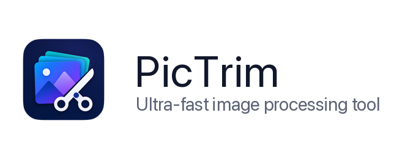
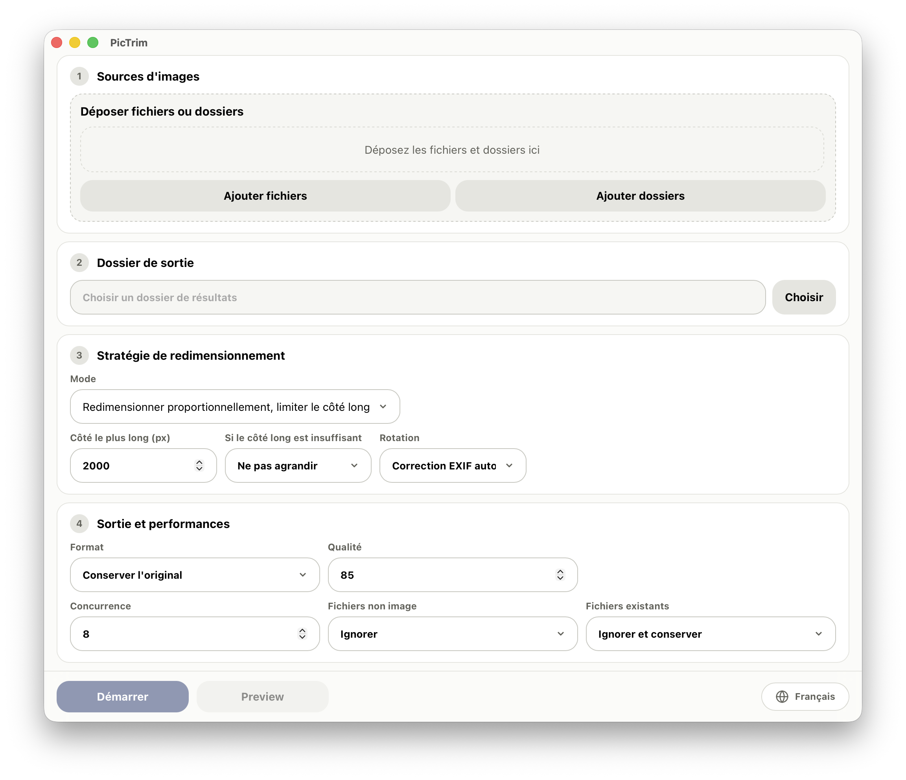

<p>
  
</p>

[English](../../README.md) | [中文](README.zh-CN.md) | [日本語](README.ja.md) | [한국어](README.ko.md) | [Français](README.fr.md) | [Deutsch](README.de.md)

PicTrim est un outil performant de traitement d'images par lot. Il permet de redimensionner, compresser, faire pivoter et convertir des images en masse.



## Fonctionnalités

- Mélangez fichiers image et dossiers en entrée, ou glissez-les directement dans l'application.
- Redimensionnez par côté le plus long, boîte englobante, recadrage fixe, largeur ou hauteur.
- Exportez en JPG, PNG ou WebP, ou conservez le format d'origine.
- Configurez la qualité, la rotation, la concurrence, l'agrandissement et la gestion des fichiers existants.
- Conservez la structure des dossiers avec progression, statistiques, journaux et échecs en temps réel.
- Traitez les images intégrées au contenu des pages PDF, y compris les Form XObjects imbriqués et les inline images.

## Comportement PDF

- « Conserver l’original » garde le conteneur PDF et remplace uniquement les images des pages. Texte, vecteurs, liens, formulaires, dimensions et placement sont conservés.
- JPG / PNG / WebP ignore le reste du PDF et exporte chaque image unique une fois dans `<nom PDF>/page-0001-image-0001.ext`.
- La première version prend en charge JPEG, JPX, Flate, LZW, Gray/RGB/CMYK/Indexed/ICCBased, les échantillons 8 bits et les masques courants. L’aperçu PDF n’est pas encore disponible.
- Un PDF protégé par un mot de passe non vide échoue sans sortie. Les champs de signature sont conservés, mais la signature d’origine devient invalide.

## Performances

- PicTrim vise à être un outil de traitement d'images par lot extrêmement rapide.
- Le cœur utilise Rust et libvips pour un débit élevé et une faible consommation mémoire.
- Une file de tâches en streaming et un traitement multithread rendent les très grands ensembles d'images pratiques.
- Les fichiers de sortie existants peuvent être ignorés, ce qui facilite les exécutions répétées ou incrémentales.

## Utilisation

1. Ajoutez des fichiers image ou des dossiers.
2. Choisissez un dossier de sortie.
3. Réglez la taille, le format, la qualité et les options de lot.
4. Cliquez sur « Start ».

## Plateformes prises en charge

- macOS
- Windows 10 / Windows 11 64-bit

Les builds actuels ciblent macOS et Windows x64. Les paquets Linux ne sont pas encore fournis.

## Développement

```bash
npm install
npm run dev
```

Vérifier le build frontend :

```bash
npm run build
```

Vérifier la partie Rust :

```bash
cd src-tauri
cargo check
```

La compilation ou l'édition de liens du binaire Rust nécessite libvips installé localement.

macOS :

```bash
brew install vips
```

Sous Windows, utilisez le paquet précompilé officiel de libvips et définissez `VIPS_DIR` vers le dossier extrait :

```powershell
$env:VIPS_DIR = "C:\path\to\vips-dev-8.x"
$env:Path = "$env:VIPS_DIR\bin;$env:Path"
```

Vous pouvez aussi consulter le [guide d'installation officiel de libvips](https://www.libvips.org/install.html).

## Build

```bash
npm install
npm run tauri:build
```

Une fois le build terminé, `release/PicTrim/` contient la version portable locale. Les GitHub Releases publient uniquement les DMG macOS signés et notariés pour Apple Silicon et Intel, ainsi que l’installateur Windows x64.

## Notes de version

Les builds macOS sont signés avec un certificat Developer ID et notariés par Apple. Les builds Windows ne sont actuellement pas signés et peuvent afficher un avertissement SmartScreen au premier lancement.

Consultez [../release.md](../release.md) pour le processus de publication détaillé.

## Licence

PicTrim est publié sous la [MIT License](../../LICENSE).
