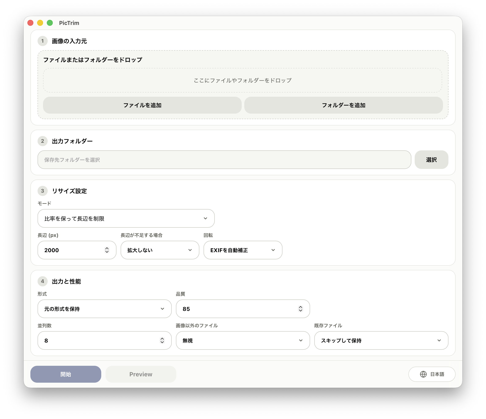

<p>
  
</p>

[English](../../README.md) | [中文](README.zh-CN.md) | [日本語](README.ja.md) | [한국어](README.ko.md) | [Français](README.fr.md) | [Deutsch](README.de.md)

PicTrim は、高性能な画像バッチ処理ツールです。画像の一括リサイズ、圧縮、回転、形式変換に対応しています。



## 機能

- 画像ファイルとフォルダーを混在して入力でき、ドラッグ＆ドロップにも対応。
- 長辺、指定幅・高さ、固定クロップなどの方法で一括リサイズ。
- JPG、PNG、WebP で出力、または元の形式を維持。
- 品質、回転、並列数、拡大可否、既存ファイルの扱いなどを設定可能。
- フォルダー構造を保持し、進捗、統計、ログ、失敗リストをリアルタイム表示。
- PDF のページ内容に埋め込まれた画像（ネストした Form XObject と inline image を含む）を処理。

## PDF の動作

- 「元の形式を保持」では PDF のまま出力し、ページ内画像だけを置換します。テキスト、ベクター、リンク、フォーム、ページサイズ、配置は保持されます。
- JPG / PNG / WebP では PDF のその他の内容を破棄し、各ユニーク画像を `<PDF名>/page-0001-image-0001.ext` に一度だけ出力します。
- JPEG、JPX、Flate、LZW、Gray/RGB/CMYK/Indexed/ICCBased、8-bit、一般的なマスクに対応します。PDF のプレビューは未対応です。
- パスワードが必要な PDF は出力せず失敗します。署名フィールドは保持されますが、元の署名は無効になります。

## パフォーマンス

- PicTrim は非常に高速な画像バッチ処理ツールを目指しています。
- コアには Rust と libvips を使用し、高速かつ低メモリで処理します。
- ストリーミングタスクキューとマルチスレッド処理により、大量の画像にも対応できます。
- 既存の出力ファイルをスキップできるため、繰り返し実行や差分処理に便利です。

## 使い方

1. 画像ファイルまたはフォルダーを追加します。
2. 出力フォルダーを選択します。
3. サイズ、形式、品質、バッチ処理オプションを設定します。
4. 「Start」をクリックします。

## 対応プラットフォーム

- macOS
- Windows 10 / Windows 11 64-bit

現在のリリースビルドは macOS と Windows x64 向けです。Linux パッケージはまだ提供していません。

## 開発

```bash
npm install
npm run dev
```

フロントエンドのビルド確認:

```bash
npm run build
```

Rust 側の確認:

```bash
cd src-tauri
cargo check
```

Rust バイナリのビルドまたはリンクには、ローカルに libvips が必要です。

macOS:

```bash
brew install vips
```

Windows では libvips 公式のプリビルドパッケージを使用し、展開先を `VIPS_DIR` に設定してください:

```powershell
$env:VIPS_DIR = "C:\path\to\vips-dev-8.x"
$env:Path = "$env:VIPS_DIR\bin;$env:Path"
```

[libvips 公式インストールガイド](https://www.libvips.org/install.html) も参照できます。

## ビルド

```bash
npm install
npm run tauri:build
```

ビルド完了後、`release/PicTrim/` にローカル用のポータブル版が生成されます。GitHub Releases では、Apple Silicon／Intel 向けの署名・公証済み macOS DMG と Windows x64 インストーラーのみを公開します。

## リリースノート

macOS リリースビルドは Developer ID 証明書で署名され、Apple の公証を受けています。Windows ビルドは現在未署名のため、初回起動時に SmartScreen の警告が表示される場合があります。

詳しいリリース手順は [../release.md](../release.md) を参照してください。

## ライセンス

PicTrim は [MIT License](../../LICENSE) の下で公開されています。
