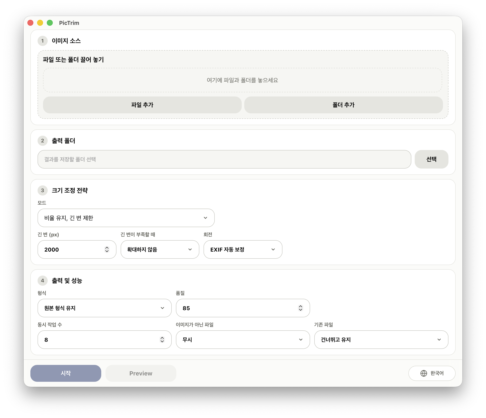

<p>
  
</p>

[English](../../README.md) | [中文](README.zh-CN.md) | [日本語](README.ja.md) | [한국어](README.ko.md) | [Français](README.fr.md) | [Deutsch](README.de.md)

PicTrim은 무료 오픈 소스 고성능 이미지 일괄 처리 도구로, 이미지 일괄 리사이즈, 압축, 회전, 형식 변환을 지원합니다. 일반 이미지뿐 아니라 PDF 파일의 용량도 줄일 수 있으며, 이미지가 많은 PDF일수록 효과가 더욱 뚜렷합니다.

## 스크린샷



## 기능

- 스트리밍 처리 방식으로 수천만 개 규모의 파일도 손쉽게 다룰 수 있습니다.
- 긴 변, 지정 너비/높이, 고정 크기 자르기 등 다양한 방식으로 일괄 리사이즈합니다.
- JPG, PNG, WebP 형식으로 출력하거나 원본 형식을 유지할 수 있습니다.
- 품질, 회전, 동시 작업 수, 확대 여부, 기존 파일 건너뛰기 등 일반적인 옵션을 설정할 수 있습니다.
- PDF를 지원하며, 원래 PDF 구조를 유지한 채 내부 이미지를 압축하거나 이미지 형식으로 출력할 수 있습니다.

## PDF 파일 처리

- **입력**: PDF 파일 또는 PDF가 포함된 폴더를 직접 추가할 수 있습니다. PicTrim은 PDF 페이지 내용에 내장된 이미지를 처리합니다.
- **원본 형식 유지 선택**: 출력은 계속 PDF 형식이며, 이미지만 교체하고 나머지 내용은 그대로 유지합니다.
- **JPG / PNG / WebP로 출력 선택**: PDF에 내장된 이미지를 개별 파일로 내보내며, `<PDF 이름>/page-0001-image-0001.jpg`와 같은 경로에 저장합니다.

## 성능

- 핵심 처리에는 Rust와 libvips를 사용하여 빠르고 메모리 사용량이 낮습니다.
- 스트리밍 작업 큐와 멀티스레드 처리로 수천만 개 규모의 이미지도 손쉽게 처리할 수 있습니다.
- 기존 출력 파일을 건너뛸 수 있어 반복 실행과 증분 처리에 유용합니다.

## 사용 방법

1. 이미지 파일, PDF 파일 또는 폴더를 추가합니다.
2. 출력 폴더를 선택합니다.
3. 크기, 형식, 품질, 일괄 처리 옵션을 설정합니다.
4. "Start"를 클릭합니다.

## 플랫폼 지원

- macOS
- Windows 10 / Windows 11 64-bit

현재 릴리스 빌드는 macOS와 Windows x64를 대상으로 합니다. Linux 패키지는 아직 제공하지 않습니다.

## 개발

```bash
npm install
npm run dev
```

프런트엔드 빌드 확인:

```bash
npm run build
```

Rust 부분 확인:

```bash
cd src-tauri
cargo check
```

Rust 바이너리를 빌드하거나 링크하려면 로컬에 libvips가 설치되어 있어야 합니다. QPDF 12.3.2, zlib 1.3.1 및 IJG libjpeg 9f는 버전이 고정되어 정적으로 빌드되므로 QPDF, CMake 또는 libclang을 별도로 설치할 필요가 없습니다.

macOS:

```bash
brew install vips
```

Windows에서는 libvips 공식 사전 빌드 패키지를 사용하고, 압축을 푼 폴더를 `VIPS_DIR`로 설정하세요:

```powershell
$env:VIPS_DIR = "C:\path\to\vips-dev-8.x"
$env:Path = "$env:VIPS_DIR\bin;$env:Path"
```

[libvips 공식 설치 가이드](https://www.libvips.org/install.html)도 참고할 수 있습니다.

## 빌드

```bash
npm install
npm run tauri:build
```

빌드가 끝나면 `release/PicTrim/`에 로컬 포터블 빌드가 생성됩니다. GitHub Releases에는 Apple Silicon 및 Intel용으로 서명·공증된 macOS DMG와 Windows x64 설치 프로그램만 게시됩니다.

## 릴리스 노트

macOS 릴리스 빌드는 Developer ID 인증서로 서명되고 Apple 공증을 받습니다. Windows 빌드는 현재 서명되지 않아 처음 실행할 때 SmartScreen 경고가 표시될 수 있습니다.

자세한 릴리스 절차는 [../release.md](../release.md)를 참고하세요.

## 라이선스

PicTrim은 [MIT License](../../LICENSE)로 배포됩니다. 포함된 종속성에 대한 고지는 [THIRD_PARTY_NOTICES.md](../../THIRD_PARTY_NOTICES.md)를 참조하세요.
