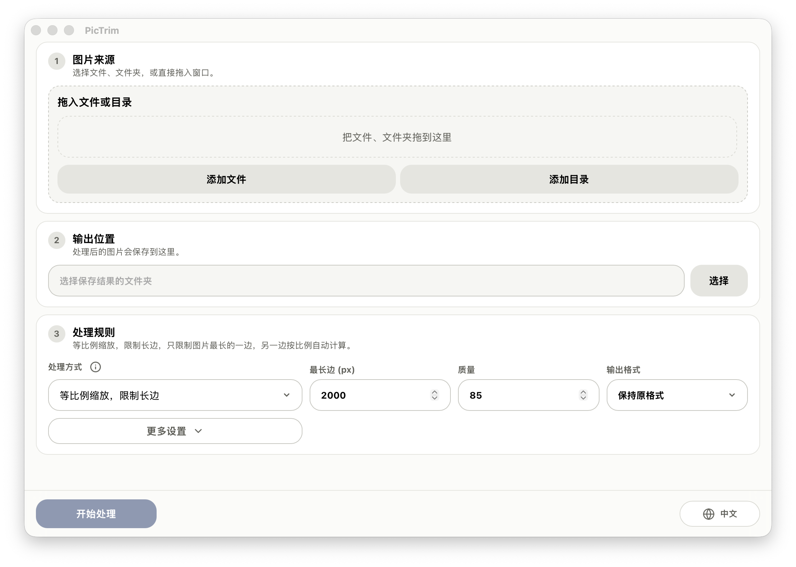

<p>
  
</p>

[English](../../README.md) | [中文](README.zh-CN.md) | [日本語](README.ja.md) | [한국어](README.ko.md) | [Français](README.fr.md) | [Deutsch](README.de.md)

PicTrim 是一个高性能的图片批处理工具。支持对图片进行批量缩放、压缩、旋转和格式转换。



## 功能

- 支持图片文件和目录混合输入，也可以直接拖拽。
- 支持按最长边、指定宽高、固定裁剪等方式批量缩放。
- 支持 JPG、PNG、WebP 输出，也可以保持原格式。
- 支持质量、旋转、并发数、是否放大、是否跳过已有文件等常用选项。
- 保留目录结构，实时显示进度、统计和失败列表。
- 处理 PDF 页面内容中的内嵌图片，包括嵌套 Form XObject 和 inline image。

## PDF 处理规则

- 选择“保持原格式”时仍输出 PDF，只替换页面主体图片，保留文字、矢量、链接、表单、页面尺寸和图片放置位置。
- 选择 JPG、PNG 或 WebP 时，丢弃 PDF 其他内容，每个唯一图片对象输出一次，路径为 `<PDF文件名>/page-0001-image-0001.ext`。
- 第一版支持 JPEG、JPX、Flate、LZW，以及 Gray、RGB、CMYK、Indexed、ICCBased、8-bit 样本和常见透明蒙版。
- 不处理缩略图、附件、批注和表单外观图片；PDF 暂不进入预览。
- 非空密码 PDF 会失败且不产生输出；空密码加密会保留。签名字段会保留，但处理后原签名失效并显示警告。
- 遇到不支持或损坏的目标图片时整份 PDF 原子失败，不发布部分结果。

## 性能

- 本项目的核心目标是打造最高性能的图片批量处理工具。
- 底层使用 Rust 和 libvips，处理速度快、内存占用低。
- 使用流式任务队列 + 多线程并发处理，轻松处理千万级数量的图片。
- 支持跳过已存在的输出文件，便于重复运行和增量处理。

## 使用

1. 添加图片文件或文件夹。
2. 选择输出目录。
3. 设置尺寸、格式、质量和批处理选项。
4. 点击“开始处理”。

## 系统支持

- macOS
- Windows 10 / Windows 11 64 位

当前发布构建面向 macOS 和 Windows x64。Linux 暂未提供打包支持。

## 开发

```bash
npm install
npm run dev
```

检查前端构建：

```bash
npm run build
```

检查 Rust 部分：

```bash
cd src-tauri
cargo check
```

编译或链接 Rust 二进制文件需要在本机安装 libvips。

macOS：

```bash
brew install vips
```

Windows 推荐使用 libvips 官方预编译包，并设置 `VIPS_DIR` 指向解压后的目录：

```powershell
$env:VIPS_DIR = "C:\path\to\vips-dev-8.x"
$env:Path = "$env:VIPS_DIR\bin;$env:Path"
```

也可以参考 [libvips 官方安装说明](https://www.libvips.org/install.html)。

## 构建

```bash
npm install
npm run tauri:build
```

构建完成后，`release/PicTrim/` 目录包含本地便携版产物。GitHub Releases 只发布适用于 Apple Silicon 和 Intel 的已签名、公证 macOS DMG，以及 Windows x64 安装程序。

## 发布说明

macOS 发布构建已使用 Developer ID 证书签名并通过 Apple 公证。Windows 构建目前尚未签名，首次打开时可能显示 SmartScreen 警告。

更详细的发布步骤见 [../release.md](../release.md)。

## 许可证

PicTrim 基于 [MIT License](../../LICENSE) 发布。
